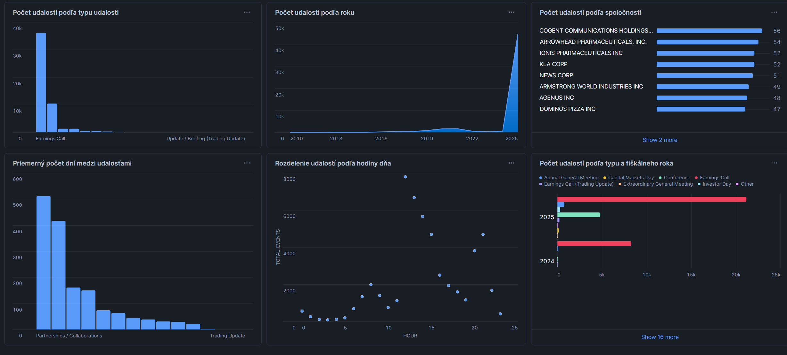

[english version below]
# **ELT proces datasetu COMPANY**

<br>


V tomto projekte sa zameriavame na analýzu datasetu **COMPANY** zo Snowflake marketplace, ktorý je súčasťou [Snowflake Public Data (Free)](https://app.snowflake.com/marketplace/listing/GZTSZ290BV255/snowflake-public-data-products-snowflake-public-data-free?search=snowflake&originTab=provider&providerName=Snowflake+Public+Data+Products&profileGlobalName=GZTSZAS2KCS).

Pomocou ELT procesu v Snowflake vytvárame dátový sklad (DWH) so Star schémou, ktorý umožňuje analytické spracovanie dát z oblasti firemnej štruktúry, korporátnych vzťahov a udalostí v čase. Výsledný dátový model umožňuje multidimenzionálnu analýzu firemných udalostí, porovnávanie spoločností, sledovanie vývoja v čase a ich vizualizáciu.

Dataset Company bol zvolený z dôvodu svojej komplexnosti a realistického charakteru, keďže obsahuje firemné udalosti vhodné pre analytické spracovanie v dátovom sklade. Dáta podporujú analytický pohľad na firemnú aktivitu a vývoj spoločností v čase, čo umožňuje hodnotiť ich dynamiku a porovnávať správanie jednotlivých firiem.


<br>


## **1. Úvod a popis zdrojových dát**


Dataset COMPANY sprístupňuje verejne dostupné údaje o spoločnostiach a ich podnikateľskom prostredí. Obsahuje základné identifikačné údaje, vybrané charakteristiky spoločností a záznamy o firemných udalostiach vrátane časových a textových atribútov.


Analýza je zameraná najmä na:


* analýzu firemných udalostí a ich vývoja v čase
* porovnanie spoločností na základe počtu a frekvencie udalostí
* identifikáciu trendov v aktivite spoločností
* analýzu odstupov medzi jednotlivými udalosťami spoločností

Vzťahy medzi spoločnosťami, doménami a cennými papiermi nie sú priamo analyzované v dimenzionálnom modeli, keďže nie sú súčasťou definovaného analytického cieľa projektu.


Zdrojové dáta pochádzajú z tabuliek:


* `COMPANY_INDEX` - centrálna tabuľka obsahujúca základné identifikačné údaje o spoločnostiach
* `COMPANY_CHARACTERISTICS` - charakteristiky spoločností s časovou platnosťou
* `COMPANY_DOMAIN_RELATIONSHIP` - vzťahy spoločností k doménam s definovaným obdobím platnosti
* `COMPANY_RELATIONSHIPS` - vzťahy medzi spoločnosťami
* `COMPANY_SECURITY_RELATIONSHIPS` - vzťahy spoločností na cenné papiere (ako akcie, dlhopisy)
* `COMPANY_EVENT_TRANSCRIPT_ATTRIBUTES` - údaje o firemných udalostiach vrátane textových transkriptov


<br>


### **1.1 Dátová architektúra**


#### **ERD - entitno-relačný diagram**


Surová (raw) vrstva obsahuje neupravené dáta z pôvodnej štruktúry datasetu, znázornené pomocou ERD. Zdrojový dataset neobsahuje explicitne definované primárne kľúče, no pre účely ERD sme ich definovali na základe logických súvislostí, aby bolo možné jasne identifikovať vzťahy medzi tabuľkami a pripraviť dátový model pre ďalšie kroky.


<p align="center">
  
  <br>
  <em>Obrázok 1 – Entitno-relačný diagram Company datasetu</em>
</p>


<br>


## **2. Dimenzionálny model**


Z pôvodného ERD bola vytvorená Star schéma podľa Kimballovej metodológie, ktorá obsahuje 1 tabuľku faktov:
* `fact_company_events` - jednotlivé firemné udalosti a odvodené metriky
  - fact_id - primárny kľúč
  - company_sk, event_type_id, date_id, time_id - cudzie kľúče na dimenzie
  - event_count – počet udalostí (hodnota 1 pre každý záznam), používaná na agregácie
  - events_per_year – počet udalostí spoločnosti za daný rok (vypočítané pomocou window function `COUNT(*) OVER`)
  - days_since_prev_event – počet dní od predchádzajúcej udalosti danej spoločnosti (vypočítané pomocou window function `LAG() OVER`)

    
napojenú na 4 dimenzie:
* `dim_event_type` - klasifikačné informácie o type udalosti (typ transkriptu, fiškálneho obdobie)
    * SCD Typ 1 – tieto údaje udalostí sa spätne nevyhodnocujú, históriu neuchovávame
* `dim_company` - základné identifikačné informácie o spoločnostiach, ako je názov, úroveň entity, identifikátory
    * SCD Typ 1 – historické zmeny sa neuchovávajú, analýza je zameraná na aktuálny stav spoločnosti v čase výskytu udalosti, nie na historický vývoj jej atribútov
* `dim_date` - informácie o dátumoch udalostí (od roku až po deň v týždni)
    * SCD Typ 0 – dátumová dimenzia je nemenná, nepodlieha aktualizáciám
* `dim_time` - informácie o čase udalostí (od konkrétneho času až po sekundu)
    * SCD Typ 0 – časová dimenzia je tiež nemenná a statická
 
Všetky dimenzie sú prepojené s faktovou tabuľkou vzťahom 1:N prostredníctvom surrogate kľúčov. Surogátne kľúče sú umelo vytvorené technické identifikátory, ktoré nemajú žiadny biznisový význam. Sú stabilné a jednoznačné a vďaka nim sa ľahko uchováva história (keby máme napríklad SCD typ 2, chceme rozšíriť náš model), môžme ľahko robiť `JOIN`-y medzi tabuľkou faktov (ktorá je takto prehľadnejšia) a dimenziami.

Samotná štruktúra hviezdicovej schémy je znázornená na diagrame nižšie, kde môžeme pozorovať jednotlivé vzťahy a prepojenia medzi tabuľkami. Môžeme si taktiež všimnúť, že niektoré údaje z pôvodného ERD sme vynechali, keďže nie sú relevantné pre našu analýzu udalostí a ich zahrnutie by znižovalo prehľadnosť modelu.

<p align="center">
  
  <br>
  <em>Obrázok 2 – Star schéma pre Company dataset</em>
</p>

<br>

## **3. ELT proces v Snowflake**

ETL proces pozostáva z troch hlavných častí:
- E - Extract - extrahovanie dát
- L - Load - načítanie dát
- T - Transform - transformácia dát

Tento proces bol implementovaný v Snowflake s cieľom pripraviť zdrojové dáta zo staging vrstvy do viacdimenzionálneho modelu vhodného na analýzu a vizualizáciu.

<br>

### **3.1 Extract a load**

V tejto časti sa spájajú fázy Extract a Load – dôvodom je, že nepoužívame CSV alebo iné externé súbory, z ktorých by sme dáta museli extrahovať a nahrávať do Snowflake stage, a náš zdrojový dataset Company je dostupný priamo v Snowflake Marketplace v databáze `snowflake_public_data_free` a schéme `public_data_free`.

Vytvorili sme si staging tabuľky, do ktorých boli importované surové dáta (čo je vlastne Load fáza) z pôvodného datasetu (takže `SELECT` je Extract fáza), čiže sa obe fázy stanú v jednom príkaze. Staging tabuľky slúžia ako dočasná surová vrstva, nad ktorou sa realizujú ďalšie transformácie.
Po vytvorení Star schémy a ujasnení si, čo bude naša fact tabuľka, sme prišli na to, že nám stačí vytvoriť 2 staging tabuľky z `company_index` a `company_event_transcript_attributes`.

Extrakcia a načítanie dát bola zabezpečená kódom:

```sql
CREATE OR REPLACE TABLE company_index_staging AS
SELECT * FROM snowflake_public_data_free.public_data_free.company_index;

CREATE OR REPLACE TABLE company_event_transcript_attributes_staging AS
SELECT *
FROM snowflake_public_data_free.public_data_free.company_event_transcript_attributes;
```
<br>

### **3.2 Transform**

V transformačnej fáze čistíme, obohacujeme a reorganizujeme dáta zo staging tabuliek. Cieľom je, podľa nášho  viacdimenzionálneho modelu Star schema, vytvoriť tabuľku faktov a tabuľky dimenzii. Vďaka nim budeme môcť neskôr robiť efektívnu analýzu udalostí a ich následnú vizualizáciu.
Tabuľky dimenzíí nemali prirodzený primárny kľúč, tak sme si vytvorili surogátne kľúče, ktorý neskôr uľahčí prácu s tabuľkami a jednoznačne prepojí faktovú tabuľku s jej dimenziami.
Vo všetkých dimenziách bolo použité kľúčové slovo `DISTINCT`. Keby sme ho nepoužili, mohli by sa v dimenziách opakovať rovnaké kombinácie hodnôt, teda by došlo k duplikácii hodnôt a zväčšil by sa objem dát, keďže by tabuľky obsahovali redundantné hodnoty.

- `dim_company` obsahuje údaje o spoločnostiach vrátane názvu, typu entity, identifikátorov ako EIN, CIK či permID a pole LEI. 
`company_sk` sme pre úplnosť pridali ako surogate key, `company_id` predstavuje business key (originálny identifikátor).

```sql
CREATE OR REPLACE TABLE dim_company (
    company_sk INT AUTOINCREMENT PRIMARY KEY,   
    company_id VARCHAR(32),                      
    company_name VARCHAR(1000),
    entity_level VARCHAR(255),
    ein VARCHAR(255),
    cik VARCHAR(255),
    lei array,
    permid_company_id VARCHAR(255)
);

INSERT INTO dim_company (company_id, company_name, entity_level, ein, cik, lei, permid_company_id)
SELECT DISTINCT company_id, company_name, entity_level, ein, cik, lei, permid_company_id
FROM company_index_staging;
```

- `dim_event_type` uchováva klasifikačné informácie o firemných udalostiach, ako typy udalostí, typ transcriptu, fiškálne obdobie a rok.
```sql
CREATE OR REPLACE TABLE dim_event_type (
    event_type_id INT AUTOINCREMENT PRIMARY KEY,
    event_type VARCHAR(255),
    transcript_type VARCHAR(255),
    fiscal_period VARCHAR(255),
    fiscal_year VARCHAR(255)
);

INSERT INTO dim_event_type (event_type, transcript_type, fiscal_period, fiscal_year)
SELECT DISTINCT event_type, transcript_type, fiscal_period, fiscal_year
FROM company_event_transcript_attributes_staging;
```

- `dim_date` uchováva informácie o dátumoch udalostí. Obsahuje odvodené údaje ako deň, mesiac, rok, štvrťrok a deň v týždni.
```sql
CREATE OR REPLACE TABLE dim_date (
    date_id INT AUTOINCREMENT PRIMARY KEY,
    date DATE,
    year INT,
    month INT,
    day INT,
    quarter INT,
    weekday INT
);

INSERT INTO dim_date (date, year, month, day, quarter, weekday)
SELECT DISTINCT
    TO_DATE(event_timestamp) AS date,
    YEAR(event_timestamp) AS year,
    MONTH(event_timestamp) AS month,
    DAY(event_timestamp) AS day,
    QUARTER(event_timestamp) AS quarter,
    DAYOFWEEK(event_timestamp) AS weekday
FROM company_event_transcript_attributes_staging;
```

- `dim_time` poskytuje detailné informácie o čase udalosti, vrátane hodiny, minúty, sekundy a AM/PM označenia. 
```sql
CREATE OR REPLACE TABLE dim_time (
    time_id INT AUTOINCREMENT PRIMARY KEY,
    time TIME,
    hour INT,
    minute INT,
    second INT,
    am_pm CHAR(2)
);

INSERT INTO dim_time (time, hour, minute, second, am_pm)
SELECT DISTINCT
    CAST(event_timestamp AS TIME) AS time,
    EXTRACT(HOUR FROM event_timestamp) AS hour,
    EXTRACT(MINUTE FROM event_timestamp) AS minute,
    EXTRACT(SECOND FROM event_timestamp) AS second,
    CASE WHEN EXTRACT(HOUR FROM event_timestamp) < 12 THEN 'AM' ELSE 'PM' END AS am_pm
FROM company_event_transcript_attributes_staging;
```

- Faktová tabuľka `fact_company_events` obsahuje záznamy o jednotlivých udalostiach a prepojenia na všetky dimenzie. Obsahuje navyše metriky, ako je počet udalostí, počet udalostí za rok a počet dní od predchádzajúcej udalosti.

```sql
CREATE OR REPLACE TABLE fact_company_events (
    fact_id INT AUTOINCREMENT PRIMARY KEY,
    company_sk INT,
    event_type_id INT,
    date_id INT,
    time_id INT,
    event_count INT,
    events_per_year INT,
    days_since_prev_event INT
);

INSERT INTO fact_company_events (company_sk, event_type_id, date_id, time_id, event_count, events_per_year, days_since_prev_event)
SELECT
    c.company_sk,
    et.event_type_id,
    d.date_id,
    t.time_id,
    1 AS event_count, 
    
    COUNT(*) OVER (PARTITION BY c.company_sk, et.event_type_id, d.year) AS events_per_year,
    
    DATEDIFF(
        day,
        LAG(e.event_timestamp) OVER (PARTITION BY c.company_sk, et.event_type_id ORDER BY e.event_timestamp),
        e.event_timestamp
    ) AS days_since_prev_event
    
FROM company_event_transcript_attributes_staging e
JOIN dim_company c
    ON e.company_id = c.company_id
JOIN dim_event_type et
    ON e.event_type = et.event_type
   AND e.transcript_type = et.transcript_type
   AND e.fiscal_period = et.fiscal_period
   AND e.fiscal_year = et.fiscal_year
JOIN dim_date d
    ON TO_DATE(e.event_timestamp) = d.date
JOIN dim_time t
    ON CAST(e.event_timestamp AS TIME) = t.time;
```

Po vytvorení potrebných tabuliek dimenzii a faktu, a nahraní potrebných dát, ktoré sme si mohli overiť jednoduchým `SELECT * FROM`, odstránime staging tabuľky, aby sa optimalizovalo využitie úložiska a zachovala sa prehľadnosť databázovej štruktúry:
```sql
DROP TABLE IF EXISTS company_event_transcript_attributes_staging;
DROP TABLE IF EXISTS company_index_staging;
```
<br>

## **4. Vizualizácia dát**

Dashboard datasetu Company obsahuje 6 vizualizácii, ktoré nás prehľadne informujú o trendoch udalostí firiem a kľúčových metrikách. Umožňujú nám pochopiť správanie firiem a organizáciu firemných udalostí. Vizualizácie sú postavené nad faktovou tabuľkou `fact_company_events` a príslušnými dimenziami.


<p align="center">
  
  <br>
  <em>Obrázok 3 - Dashboard Company datasetu</em>
</p>


<br>

### **Graf 1: Počet udalostí podľa typu udalosti**

Tento stĺpcový graf ukáže, ktoré typy udalostí sa vyskytujú najčastejšie a ktoré menej často. Pomáha identifikovať najrelevantnejšie typy udalostí a ich frekvenciu. Z grafu vyplýva, že na prvom mieste je prevalentne "Earnings call", na druhom "Conference" a ostatné typy sú organizované pomenej, pričom najmenšiu hodnotu má "Update / Briefing (Trading update)"

```sql
SELECT et.event_type, COUNT(f.fact_id) AS total_events
FROM fact_company_events f
JOIN dim_event_type et ON f.event_type_id = et.event_type_id
GROUP BY et.event_type
ORDER BY total_events DESC;
```
<br>

### **Graf 2: Počet udalostí podľa roku**

Čiarový graf znázorňuje vývoj počtu udalostí v jednotlivých rokoch. Slúži na identifikáciu dlhodobých trendov a období zvýšenej, stabilnej alebo zníženej aktivity. Môžeme pozorovať prudký nárast v roku 2025.


```sql
SELECT d.year, COUNT(f.fact_id) AS total_events
FROM fact_company_events f
JOIN dim_date d ON f.date_id = d.date_id
GROUP BY d.year
ORDER BY d.year;
```
<br>

### **Graf 3: Počet udalostí podľa spoločnosti (Top 10)**

Tento graf zobrazuje desať najaktívnejších spoločností podľa počtu zaznamenaných udalostí - ukáže, ktoré spoločnosti sú najaktívnejšie alebo najviac analyzované.


```sql
SELECT c.company_name, COUNT(f.fact_id) AS total_events
FROM fact_company_events f
JOIN dim_company c ON f.company_sk = c.company_sk
GROUP BY c.company_name
ORDER BY total_events DESC
LIMIT 10;
```
<br>

### **Graf 4: Priemerný počet dní medzi udalosťami**

Vizualizácia zobrazuje priemerný počet dní medzi po sebe nasledujúcimi udalosťami pre jednotlivé typy udalostí. Použitie metriky days_since_prev_event umožňuje analyzovať periodicitu udalostí. Do analýzy boli zahrnuté iba tie typy udalostí, ktoré sa vyskytli aspoň dvakrát, a teda astribút days_since_prev_event nesmie byť NULL, aby bola zabezpečená štatistická relevantnosť výsledkov.


```sql
SELECT et.event_type, ROUND(AVG(f.days_since_prev_event), 0) AS avg_days_between_events
FROM fact_company_events f 
JOIN dim_event_type et ON f.event_type_id = et.event_type_id
WHERE f.days_since_prev_event IS NOT NULL
GROUP BY et.event_type
HAVING COUNT(f.event_type_id) >= 2
ORDER BY avg_days_between_events;
```
<br>

### **Graf 5: Rozdelenie udalostí podľa hodiny dňa**

Histogram zobrazí, v ktorých hodinách dňa sa udalosti najčastejšie organizujú. Vizualizácia pomáha identifikovať preferované časové okná pre organizovanie firemných udalostí. Výsledky naznačujú, že najviac udalostí prebieha okolo poludnia a v skorých popoludňajších hodinách, čo zodpovedá štandardným pracovným a obchodným časom.

```sql
SELECT t.hour, COUNT(f.fact_id) AS total_events
FROM fact_company_events f
JOIN dim_time t ON f.time_id = t.time_id
GROUP BY t.hour
ORDER BY t.hour;
```
<br>

### **Graf 6: Počet udalostí podľa typu a fiškálneho roka**

Skupinový stĺpcový graf ukáže, ako sa počet udalostí jednotlivých typov menil v priebehu rokov. Umožňuje sledovať trendy podľa typov. Vizualizácia umožňuje sledovať, či sa štruktúra udalostí v priebehu rokov mení. Z analýzy boli vylúčené záznamy s hodnotou fiškálneho roka 'None', aby bola zabezpečená konzistentnosť časovej analýzy.

```sql
SELECT et.event_type, et.fiscal_year, COUNT(f.fact_id) AS total_events
FROM fact_company_events f
JOIN dim_event_type et ON f.event_type_id = et.event_type_id
WHERE et.fiscal_year != 'None'
GROUP BY et.event_type, et.fiscal_year
ORDER BY et.fiscal_year, total_events DESC;
```
<br>

# **5. Záver a zhrnutie**

V projekte sme implementovali ELT proces nad datasetom Company zo Snowflake Marketplace a vytvorili dátový sklad so Star schémou. Vďaka faktovej tabuľke a dimenziám sme mohli efektívne analyzovať firemné udalosti, sledovať trendy v čase, porovnávať spoločnosti a vyhodnocovať periodicitu udalostí.

Vizualizácie poskytujú prehľad o kľúčových metrikách, ako je počet udalostí podľa typu, spoločnosti, času či fiškálneho roka, a umožňujú identifikovať dominantné typy udalostí a ich rozloženie v čase. Tento prístup poskytuje silný analytický základ pre ďalšie rozhodovanie, reportovanie alebo vizualizáciu firemných dát.

Projekt tak demonštruje praktické využitie Snowflake, ELT procesu a dimenzionálneho modelovania na spracovanie a analýzu reálnych korporátnych dát.

**Autor:** Ema Radzová
<br>
<br>
***
<br>
<br>

# **ELT process of dataset COMPANY**

<br>


In this project, I focus on analyzing the **COMPANY** dataset from the Snowflake marketplace, which is a part of [Snowflake Public Data (Free)](https://app.snowflake.com/marketplace/listing/GZTSZ290BV255/snowflake-public-data-products-snowflake-public-data-free?search=snowflake&originTab=provider&providerName=Snowflake+Public+Data+Products&profileGlobalName=GZTSZAS2KCS).

Using the ELT process in Snowflake, I create a data warehouse (DWH) with a Star schema, which enables analytical processing of data from the areas of company structure, corporate relationships, and events over time. The resulting data model enables multidimensional analysis of company events, comparison of companies, monitoring of developments over time and their visualization.

The Company dataset was chosen for its complexity and realistic nature, as it contains corporate events suitable for analytical processing in a data warehouse. The data supports an analytical view of corporate activity and the development of companies over time, allowing for the evaluation of their dynamics and the comparison of the behavior of individual companies.


<br>


## **1.  Introduction and description of source data**


The COMPANY dataset provides publicly available data on companies and their business environment. It contains basic identification data, selected company characteristics, and records of corporate events, including time and text attributes.


The analysis focuses mainly on:


* analysis of corporate events and their development over time
* comparison of companies based on the number and frequency of events
* identification of trends in company activity
* analysis of intervals between individual company events

Relationships between companies, domains, and securities are not directly analyzed in the dimensional model, as they are not part of the defined analytical goal of the project.


The source data comes from the following tables:


* `COMPANY_INDEX` - a central table containing basic identification data about companies
* `COMPANY_CHARACTERISTICS` - characteristics of companies with time validity
* `COMPANY_DOMAIN_RELATIONSHIP` - relationships of companies to domains with a defined period of validity
* `COMPANY_RELATIONSHIPS` - relationships between companies
* `COMPANY_SECURITY_RELATIONSHIPS` - relationships of companies to securities (such as stocks, bonds)
* `COMPANY_EVENT_TRANSCRIPT_ATTRIBUTES` - data about company events, including text transcripts


<br>


### **1.1 Data architecture**


#### **ERD - entity-relationship diagram**


The raw layer contains unmodified data from the original dataset structure, represented using ERD. The source dataset does not contain explicitly defined primary keys, but for the purposes of ERD, we have defined them based on logical relationships so that we can clearly identify the relationships between tables and prepare a data model for further steps.


<p align="center">
  
  <br>
  <em>Image 1 – Entity-relationship diagram of the Company dataset</em>
</p>


<br>


## **2. Dimensional model**


The original ERD was used to create a Star schema according to Kimball's methodology, which contains 1 fact table:
* `fact_company_events` - individual company events and derived metrics
  - fact_id - primary key
  - company_sk, event_type_id, date_id, time_id - foreign keys to dimensions
  - event_count – number of events (value 1 for each record), used for aggregation
  - events_per_year – number of company events for a given year (calculated using the window function `COUNT(*) OVER`)
  - days_since_prev_event – number of days since the previous event for a given company (calculated using the window function `LAG() OVER`)

    
linked to 4 dimensions:
* `dim_event_type` - classification information about the type of event (transcript type, fiscal period)
  * SCD Type 1 – these event data are not evaluated retrospectively, we do not store history
* `dim_company` - basic identification information about companies, such as name, entity level, identifiers
  * SCD Type 1 - historical changes are not stored, the analysis focuses on the current state of the company at the time of the event, not on the historical development of its attributes
* `dim_date` - information about event dates (from year to day of the week)
  * SCD Type 0 – the date dimension is immutable and not subject to updates
* `dim_time` - information about event times (from a specific time to the second)
  * SCD Type 0 – the time dimension is also immutable and static
 

 
 
All dimensions are linked to the fact table with a 1:N relationship via surrogate keys. Surrogate keys are artificially created technical identifiers that have no business meaning. They are stable and unique, making it easy to store history (for example, if we have SCD type 2, want to expand our model), and we can easily perform `JOIN`s between the fact table (which is more transparent this way) and the dimensions.

The structure of the star schema itself is shown in the diagram below, where we can see the individual relationships and connections between tables. We can also see that we have omitted some data from the original ERD, as it is not relevant to our analysis of events and its inclusion would reduce the clarity of the model.

<p align="center">
  
  <br>
  <em>Image 2 – Star schema for Company dataset</em>
</p>

<br>

## **3. ELT process in Snowflake**

The ETL process consists of three main parts:
- E - Extract - data extraction
- L - Load - data loading
- T - Transform - data transformation

This process was implemented in Snowflake to prepare source data from the staging layer into a multidimensional model suitable for analysis and visualization.

<br>

### **3.1 Extract and load**

In this section, the Extract and Load phases are combined because we do not use CSV or other external files from which we would have to extract data and load it into Snowflake stage, and our source dataset Company is available directly in Snowflake Marketplace in the `snowflake_public_data_free` database and `public_data_free` schema.

We created staging tables into which raw data was imported (which is basically the Load phase) from the original dataset (so `SELECT` is the Extract phase), meaning that both phases take place in a single command. Staging tables serve as a temporary raw layer over which further transformations are performed.
After creating the Star schema and clarifying what our fact table would be, we realized that we only needed to create two staging tables from `company_index` and `company_event_transcript_attributes`.

Data extraction and loading was handled by the following code:

```sql
CREATE OR REPLACE TABLE company_index_staging AS
SELECT * FROM snowflake_public_data_free.public_data_free.company_index;

CREATE OR REPLACE TABLE company_event_transcript_attributes_staging AS
SELECT *
FROM snowflake_public_data_free.public_data_free.company_event_transcript_attributes;
```
<br>

### **3.2 Transform**

In the transformation phase, we clean, enrich, and reorganize data from staging tables. The goal is to create a fact table and dimension tables according to our multidimensional Star schema model. Thanks to these, we will later be able to perform effective analysis of events and their subsequent visualization.
The dimension tables did not have a natural primary key, so we created surrogate keys, which will later facilitate working with tables and clearly link the fact table with its dimensions.
The keyword `DISTINCT` was used in all dimensions. If we had not used it, the same combinations of values could have been repeated in the dimensions, which would have resulted in duplication of values and increased data volume, as the tables would have contained redundant values.

- `dim_company` contains data about companies, including name, entity type, identifiers such as EIN, CIK, or permID, and the LEI field. 
For completeness, we added `company_sk` as a surrogate key, and `company_id` represents the business key (original identifier).

```sql
CREATE OR REPLACE TABLE dim_company (
    company_sk INT AUTOINCREMENT PRIMARY KEY,   
    company_id VARCHAR(32),                      
    company_name VARCHAR(1000),
    entity_level VARCHAR(255),
    ein VARCHAR(255),
    cik VARCHAR(255),
    lei array,
    permid_company_id VARCHAR(255)
);

INSERT INTO dim_company (company_id, company_name, entity_level, ein, cik, lei, permid_company_id)
SELECT DISTINCT company_id, company_name, entity_level, ein, cik, lei, permid_company_id
FROM company_index_staging;
```

- `dim_event_type` stores classification information about corporate events, such as event types, transcript types, fiscal periods, and years.
```sql
CREATE OR REPLACE TABLE dim_event_type (
    event_type_id INT AUTOINCREMENT PRIMARY KEY,
    event_type VARCHAR(255),
    transcript_type VARCHAR(255),
    fiscal_period VARCHAR(255),
    fiscal_year VARCHAR(255)
);

INSERT INTO dim_event_type (event_type, transcript_type, fiscal_period, fiscal_year)
SELECT DISTINCT event_type, transcript_type, fiscal_period, fiscal_year
FROM company_event_transcript_attributes_staging;
```

- `dim_date` stores information about event dates. Contains derived data such as day, month, year, quarter, and day of the week.
```sql
CREATE OR REPLACE TABLE dim_date (
    date_id INT AUTOINCREMENT PRIMARY KEY,
    date DATE,
    year INT,
    month INT,
    day INT,
    quarter INT,
    weekday INT
);

INSERT INTO dim_date (date, year, month, day, quarter, weekday)
SELECT DISTINCT
    TO_DATE(event_timestamp) AS date,
    YEAR(event_timestamp) AS year,
    MONTH(event_timestamp) AS month,
    DAY(event_timestamp) AS day,
    QUARTER(event_timestamp) AS quarter,
    DAYOFWEEK(event_timestamp) AS weekday
FROM company_event_transcript_attributes_staging;
```

- `dim_time` provides detailed information about the time of the event, including hours, minutes, seconds, and AM/PM indicators. 
```sql
CREATE OR REPLACE TABLE dim_time (
    time_id INT AUTOINCREMENT PRIMARY KEY,
    time TIME,
    hour INT,
    minute INT,
    second INT,
    am_pm CHAR(2)
);

INSERT INTO dim_time (time, hour, minute, second, am_pm)
SELECT DISTINCT
    CAST(event_timestamp AS TIME) AS time,
    EXTRACT(HOUR FROM event_timestamp) AS hour,
    EXTRACT(MINUTE FROM event_timestamp) AS minute,
    EXTRACT(SECOND FROM event_timestamp) AS second,
    CASE WHEN EXTRACT(HOUR FROM event_timestamp) < 12 THEN 'AM' ELSE 'PM' END AS am_pm
FROM company_event_transcript_attributes_staging;
```

- The fact table `fact_company_events` contains records of individual events and links to all dimensions. It also contains metrics such as the number of events, the number of events per year, and the number of days since the previous event.

```sql
CREATE OR REPLACE TABLE fact_company_events (
    fact_id INT AUTOINCREMENT PRIMARY KEY,
    company_sk INT,
    event_type_id INT,
    date_id INT,
    time_id INT,
    event_count INT,
    events_per_year INT,
    days_since_prev_event INT
);

INSERT INTO fact_company_events (company_sk, event_type_id, date_id, time_id, event_count, events_per_year, days_since_prev_event)
SELECT
    c.company_sk,
    et.event_type_id,
    d.date_id,
    t.time_id,
    1 AS event_count, 
    
    COUNT(*) OVER (PARTITION BY c.company_sk, et.event_type_id, d.year) AS events_per_year,
    
    DATEDIFF(
        day,
        LAG(e.event_timestamp) OVER (PARTITION BY c.company_sk, et.event_type_id ORDER BY e.event_timestamp),
        e.event_timestamp
    ) AS days_since_prev_event
    
FROM company_event_transcript_attributes_staging e
JOIN dim_company c
    ON e.company_id = c.company_id
JOIN dim_event_type et
    ON e.event_type = et.event_type
   AND e.transcript_type = et.transcript_type
   AND e.fiscal_period = et.fiscal_period
   AND e.fiscal_year = et.fiscal_year
JOIN dim_date d
    ON TO_DATE(e.event_timestamp) = d.date
JOIN dim_time t
    ON CAST(e.event_timestamp AS TIME) = t.time;
```

After creating the necessary dimension and fact tables and loading the necessary data, which we could verify with a simple `SELECT * FROM`, we remove the staging tables to optimize storage usage and maintain the clarity of the database structure:
```sql
DROP TABLE IF EXISTS company_event_transcript_attributes_staging;
DROP TABLE IF EXISTS company_index_staging;
```
<br>

## **4. Data visualization**

The Company dataset dashboard contains 6 visualizations that provide clear information about company event trends and key metrics. They allow us to understand company behavior and the organization of company events. The visualizations are built on top of the `fact_company_events` fact table and the relevant dimensions.


<p align="center">
  
  <br>
  <em>Image 3 - Dashboard of Company dataset</em>
</p>


<br>

### **Graph 1: Number of events by event type**

This bar graph shows which types of events occur most frequently and which occur less frequently. It helps identify the most relevant types of events and their frequency. The chart shows that "Earnings call" is the most prevalent, followed by "Conference," with other types being organized less frequently, and "Update/Briefing (Trading update)" having the lowest value.

```sql
SELECT et.event_type, COUNT(f.fact_id) AS total_events
FROM fact_company_events f
JOIN dim_event_type et ON f.event_type_id = et.event_type_id
GROUP BY et.event_type
ORDER BY total_events DESC;
```
<br>

### **Graph 2: Number of events by year**

The line graph shows the development of the number of events in individual years. It serves to identify long-term trends and periods of increased, stable, or decreased activity. We can observe a sharp increase in 2025.


```sql
SELECT d.year, COUNT(f.fact_id) AS total_events
FROM fact_company_events f
JOIN dim_date d ON f.date_id = d.date_id
GROUP BY d.year
ORDER BY d.year;
```
<br>

### **Graph 3: Number of events by company (Top 10)**

This graph shows the ten most active companies by number of events recorded - it shows which companies are the most active or most analyzed.


```sql
SELECT c.company_name, COUNT(f.fact_id) AS total_events
FROM fact_company_events f
JOIN dim_company c ON f.company_sk = c.company_sk
GROUP BY c.company_name
ORDER BY total_events DESC
LIMIT 10;
```
<br>

### **Graph 4: Average number of days between events**

The visualization shows the average number of days between consecutive events for each event type. Using the days_since_prev_event metric allows us to analyze the periodicity of events. Only those event types that occurred at least twice were included in the analysis, and therefore the days_since_prev_event attribute must not be NULL to ensure the statistical relevance of the results.


```sql
SELECT et.event_type, ROUND(AVG(f.days_since_prev_event), 0) AS avg_days_between_events
FROM fact_company_events f 
JOIN dim_event_type et ON f.event_type_id = et.event_type_id
WHERE f.days_since_prev_event IS NOT NULL
GROUP BY et.event_type
HAVING COUNT(f.event_type_id) >= 2
ORDER BY avg_days_between_events;
```
<br>

### **Graph 5: Distribution of events by time of day**

The histogram shows the hours of the day when events are most frequently organized. The visualization helps identify preferred time slots for organizing corporate events. The results indicate that most events take place around noon and in the early afternoon, which corresponds to standard working and business hours.

```sql
SELECT t.hour, COUNT(f.fact_id) AS total_events
FROM fact_company_events f
JOIN dim_time t ON f.time_id = t.time_id
GROUP BY t.hour
ORDER BY t.hour;
```
<br>

### **Graph 6: Number of events by type and fiscal year**

The grouped bar graph shows how the number of events of each type has changed over the years. It allows you to track trends by type. The visualization allows you to see whether the structure of events has changed over the years. Records with a fiscal year value of 'None' were excluded from the analysis to ensure consistency in the time analysis.

```sql
SELECT et.event_type, et.fiscal_year, COUNT(f.fact_id) AS total_events
FROM fact_company_events f
JOIN dim_event_type et ON f.event_type_id = et.event_type_id
WHERE et.fiscal_year != 'None'
GROUP BY et.event_type, et.fiscal_year
ORDER BY et.fiscal_year, total_events DESC;
```
<br>

# **5. Conclusion and summary**

In the project, we implemented the ELT process on the Company dataset from Snowflake Marketplace and created a data warehouse with a Star schema. Thanks to the fact table and dimensions, we were able to effectively analyze company events, track trends over time, compare companies, and evaluate the frequency of events.

Visualizations provide an overview of key metrics such as the number of events by type, company, time, or fiscal year, and allow us to identify dominant event types and their distribution over time. This approach provides a strong analytical foundation for further decision-making, reporting, or visualization of corporate data.

The project thus demonstrates the practical use of Snowflake, the ELT process, and dimensional modeling for processing and analyzing real corporate data.

**Author:** Ema Radzová


